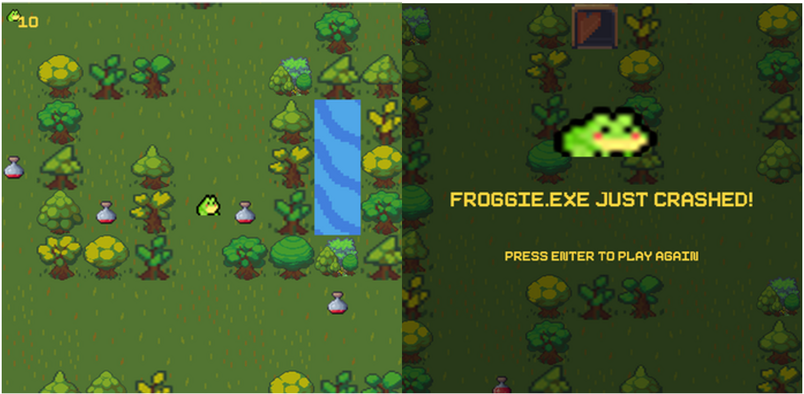

# “Frog Splash: Far From Home” - UM CSSA Game Jam 2023 

A 2D-styled arcade adventure game made using Processing (Java) for UM CSSA Game Jam 2023

*Froggie the frog is lost in the woods and must find his way home. But the path may not be as obvious as it seems, for there awaits numerous invisible “glitches” that he must avoid and overcome.*

 

---
## Links
- [Itch.io](https://tranndt.itch.io/frog-splash-far-from-home)
  
## About 
Jam Theme: 
- "Glitch"

Development Stack:
- Java/Processing

## Features
To get home safely, Froggie must:
- Navigate through a complex maze
- Avoid intricately placed hidden traps along the way
- Collect magic potions 
- Solve for the correct path

## Credit and Acknowledgement

Team members
- Jase Tran
- Long Vu
- Tri Le
- Tien Huynh

We had a bunch of fun developing this within the 48-hour Jam time frame! Excited for a follow-up one day :)

 

 

 

